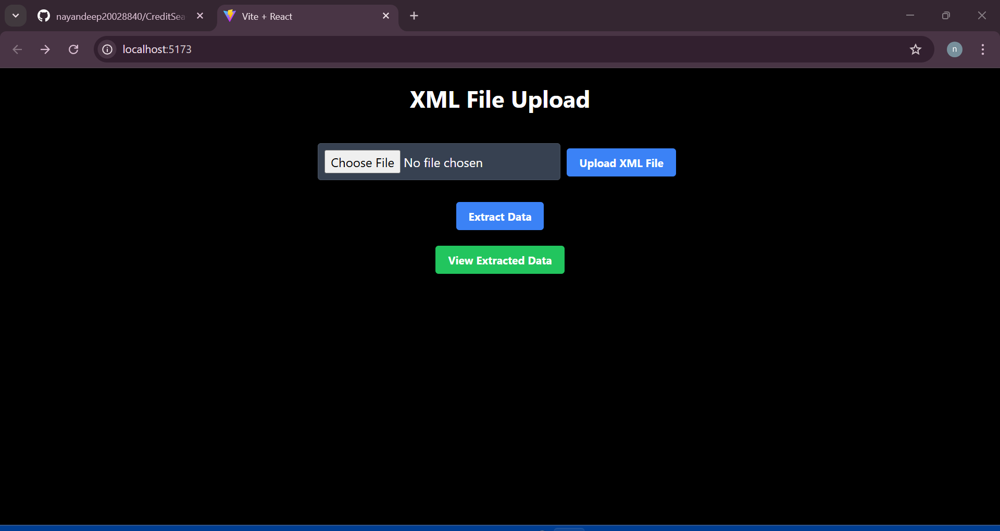
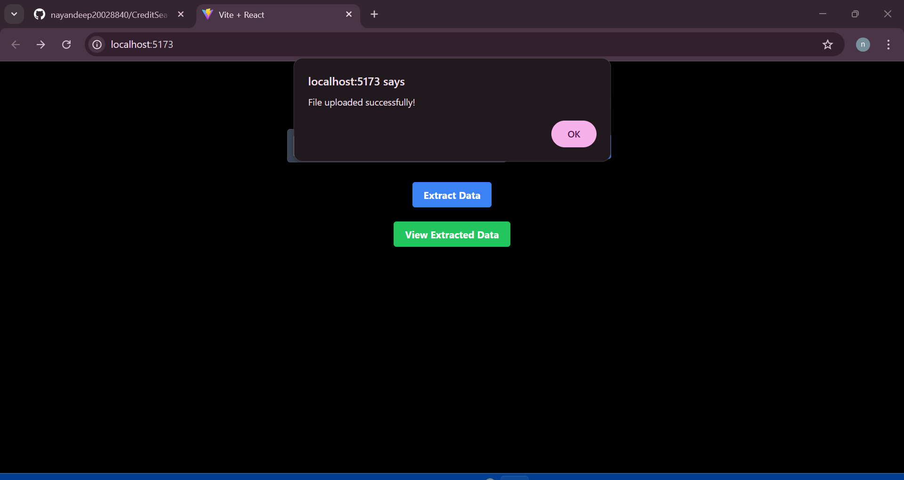
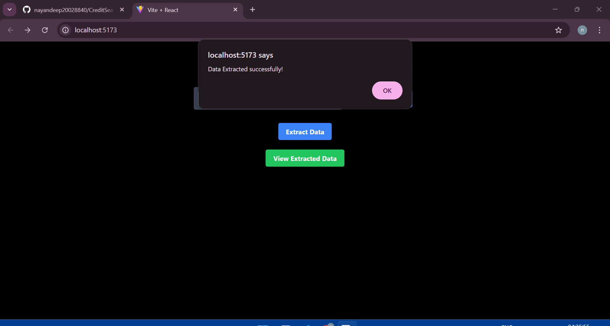
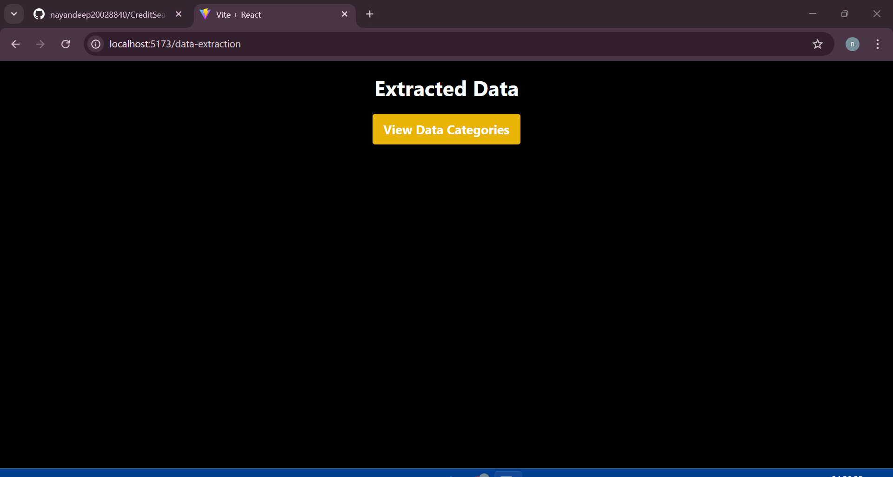
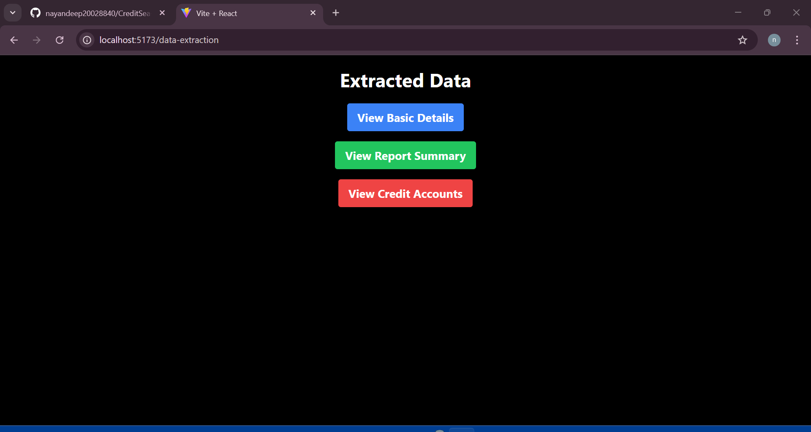
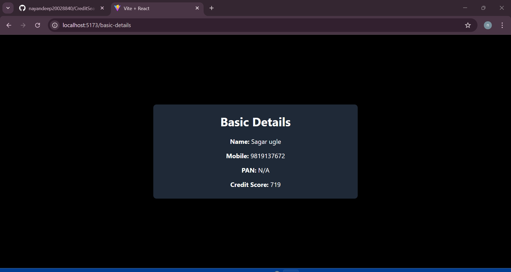
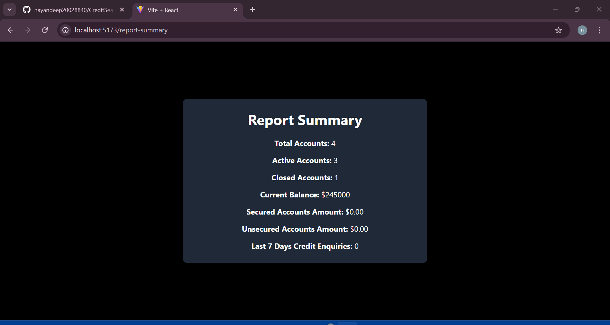
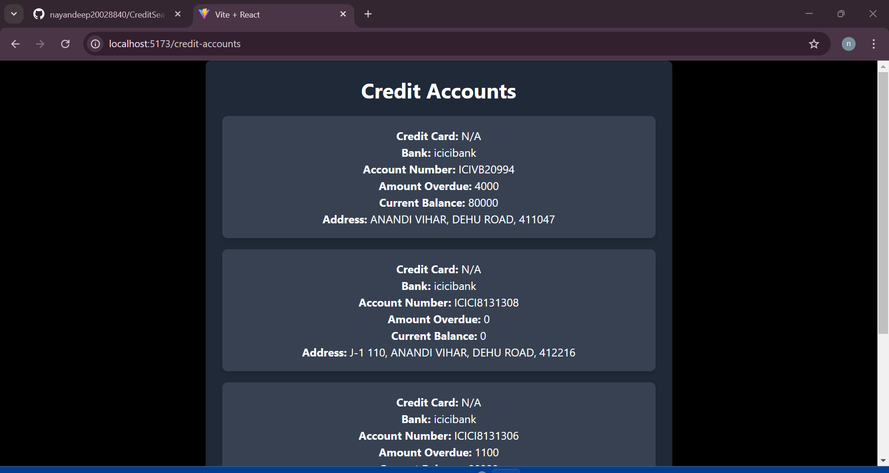

# CreditSea Fullstack Engineer Assignment

## Overview

A fullstack MERN (MongoDB, Express, React, Node.js) application that processes XML files containing soft credit pull data from Experian. The application allows users to upload XML files, extracts relevant data, stores it in MongoDB, and provides a user-friendly frontend for viewing reports.

## Features
- **XML Upload API**: Accepts and validates XML file uploads.
- **Data Extraction & Storage**: Parses XML files and stores extracted information in MongoDB Database.
- **Report Generation**: Displays extracted credit report data via a React frontend.
- **RESTful API**: Provides endpoints for data retrieval and display.
- **Error Handling & Logging**: Ensures robust handling of edge cases.

## Tech Stack
- **Backend**: Node.js, Express.js, Multer (for file upload), xml2js (for XML parsing), MongoDB (Mongoose ORM)
- **Frontend**: React.js, React Router, Axios (for API requests), Tailwind CSS
- **Database**: MongoDB

## Installation & Setup
### Prerequisites
- Node.js and npm installed
- MongoDB installed and running
- Git installed

### Clone the Repository

```sh
git clone https://github.com/nayandeep20028840/CreditSea-Fullstack-Engineer-Assignment
cd CreditSea-Fullstack-Engineer-Assignment
```

#### Backend Setup

```sh
cd backend

npm install

MONGO_URI=<your_mongodb_connection_string>

npm run dev
```

#### Frontend Setup

```sh
cd frontend

npm install

npm run dev
```

## API Endpoints

### Upload XML File

- **Method**: `POST`
- **Endpoint**: `/api/files/upload`
- **Description**: Uploads an XML file to the server. Uses the `fileUpload.single('file')` middleware to handle file uploads before passing the request to the `uploadReport` function.

### Upload XML File

- **Method**: `GET`
- **Endpoint**: `/api/files/data`
- **Description**: Retrieves the stored report data from MongoDB. This request is handled by the `getReport` function.


## Schema Design

### Fields

| Field                           | Type                | Description                                |
|---------------------------------|---------------------|--------------------------------------------|
| _id                             | ObjectId            | Unique identifier for the document         |
| **basicDetails**                | Object              | Subdocument to hold basic details          |
|     - name                      | String              | Full name of the person                    |
|     - mobilePhone               | String              | Mobile phone number                        |
|     - pan                       | String              | Personal Account Number (PAN)              |
|     - creditScore               | Number              | Credit score                               |
| **reportSummary**               | Object              | Subdocument for report summary             |
|     - totalAccounts             | Number              | Total number of accounts                   |
|     - activeAccounts            | Number              | Number of active accounts                  |
|     - closedAccounts            | Number              | Number of closed accounts                  |
|     - currentBalanceAmount      | Number              | Current balance amount                     |
|     - securedAccountsAmount     | Number              | Secured accounts amount                    |
|     - unsecuredAccountsAmount   | Number              | Unsecured accounts amount                  |
|     - last7DaysCreditEnquiries  | Number              | Credit enquiries in the last 7 days        |
| **creditAccountsInformation**   | Array               | Array of credit account details            |
|     - creditCard                | String              | Name of credit card                        |
|     - bankOfCreditCard          | String              | Bank associated with the credit card       |
|     - address                   | String              | Address linked to the account              |
|     - accountNumber             | String              | Account number                             |
|     - amountOverdue             | Number              | Amount overdue                             |
|     - currentBalance            | Number              | Current balance     


## Folder Structure

```
creditsea-fullstack-assignment/
├── backend/
│   ├── config/
│   ├── controllers/
│   ├── middleware/
│   ├── models/
│   ├── routes/
|   ├── tests/
│   ├── uploads/
│   ├── utils/
│   ├── .env.example
│   ├── .gitignore
│   ├── index.js
|   ├── package.json
├── frontend/
│   ├── public/
│   ├── src/
│   │   ├── components/
│   │   ├── hooks/
│   │   ├── App.js
│   │   ├── index.js
|   ├── tests/
|   |   ├── components/
|   |   ├── hooks/
|   |   |── integration/
│   ├── .gitignore
│   ├── package.json

├── README.md
```

## Screenshots


### localhost:3000


### File Uploaded Successfully


### Data Extracted Successfully


### Select Category


### Select Category out of 3


### Basic Details


### Report Summary


### Credit Accounts Information


